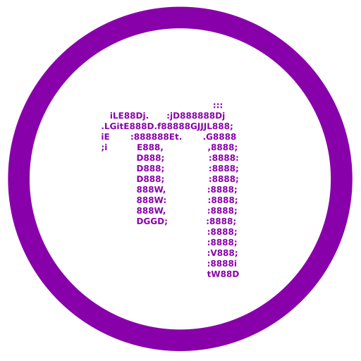

<h2 align="center">Hey there! </h2>

<p align="center">
  
</p> <br>


```csharp

------------------------------------------------------------

username: reqsd64

pronouns: he/him

status: compiling... probably

os: nix linux

favorite languages: c, cpp

locations: united states

------------------------------------------------------------

```


<h3 align="center"> Languages & Tools</h2>


## Stack

<div align="center">
<table align="center" cellpadding="10" cellspacing="0">
  <tr>
    <th width="190px" valign="middle">
      <h3 align="center">Lang</h3>
    </th>
    <td width="680px" align="center">
      <a href="#"></a>
      <a href="#"></a>
      <a href="#"></a>
      <a href="#"></a>
      <a href="#"></a>
    </td>
  </tr>

  <tr>
    <th valign="middle">
      <h3 align="center">OS</h3>
    </th>
    <td align="center">
<a href="https://github.com/torvalds/linux">
  
</a>    <a href="https://github.com/reqsd64/my-nix-config">
  
</a> 
  </tr>

  <tr>
    <th valign="middle">
      <h3 align="center">IDE</h3>
    </th>
    <td align="center">
      <a href="https://code.visualstudio.com/"></a>
      <a href="#"></a>
    </td>
  </tr>

  <tr>
<th valign="middle">
  <h3 align="center">Programs</h3>
</th>
<td align="center">
  <a href="https://github.com/reqsd64" target="_blank" rel="noopener noreferrer"></a>
  <a href="https://open.spotify.com/user/31mmj44izidq2dv5tvsamehcdlaq" target="_blank" rel="noopener noreferrer"></a>
  <a href="https://t.me/reqsd64" target="_blank" rel="noopener noreferrer"></a>
  <a href="https://steamcommunity.com/profiles/76561199387697499/" target="_blank" rel="noopener noreferrer"></a>
</td>

  <tr>
    <th valign="middle">
      <h3 align="center">Tool</h3>
    </th>
    <td align="center">
      <a href="https://git-scm.com/"></a>
    </td>
  </tr>
</table>
</div>


<table align="center">
<tr>
<td>

</td>
<td>

</td>
</tr>
</table>


<div align="center">

[](https://reqsd64.xyz)
[](https://github.com/reqsd64)
[](https://t.me/reqsd64)

</div>


<h3 align="center">Thanks for Reading <3</h3>

